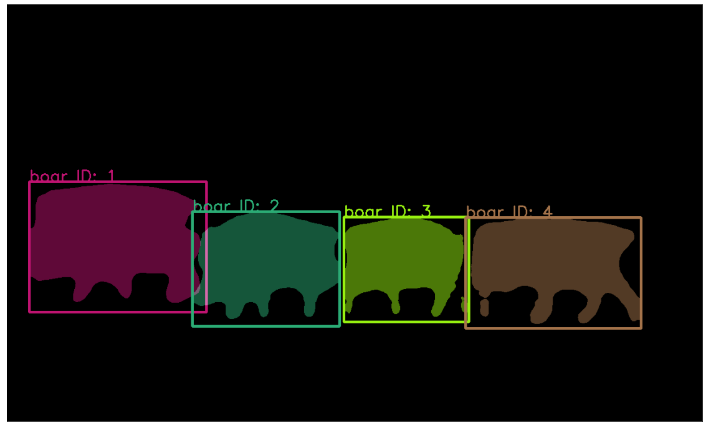
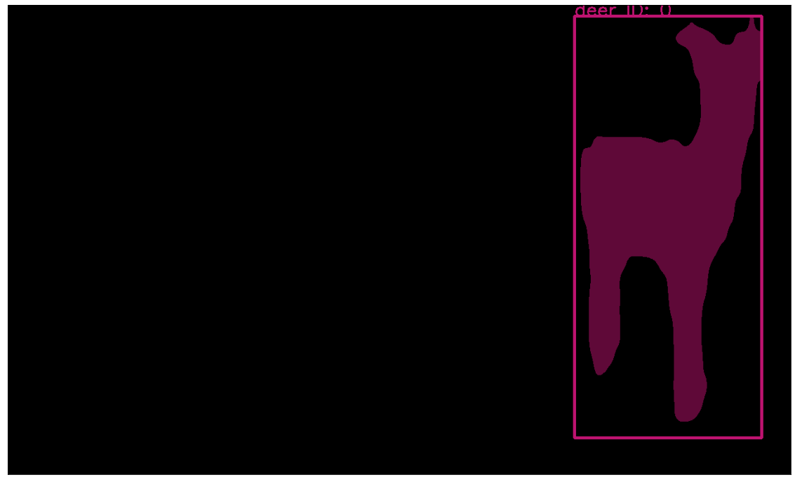
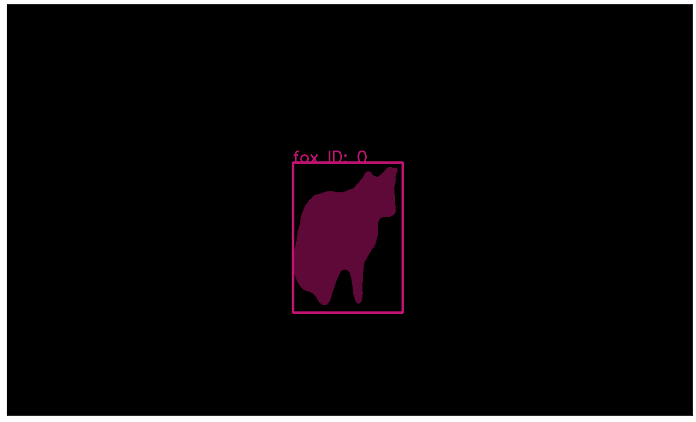
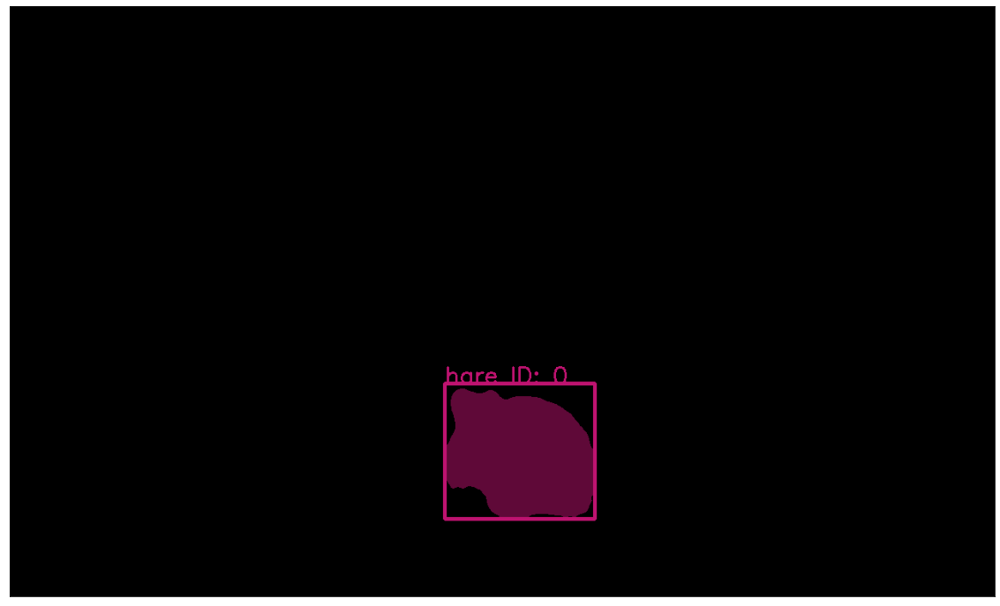

# VAE for Video Instance Segementation Tracking 

This source code is a personal customized implementation for wild animal datasets based on the proposed idea in [Video Instance Segmentation Tracking with a Modified VAE Architecture](https://openaccess.thecvf.com/content_CVPR_2020/papers/Lin_Video_Instance_Segmentation_Tracking_With_a_Modified_VAE_Architecture_CVPR_2020_paper.pdf)






## Installation
1. Install dependencies

```sh
pip3 install -r requirements.txt
```

## Usage
Dataset's properties:
1. Videos captured wild animals of different classes.
2. Frame size: (720, 1280). It will be resized to (768, 1280) while dataset modul is defined.

There are 5 modules in this implementation:
1. dataset.py : defines datasets for the training and evaluation of Mask-RCNN and VAE, reading from wild animals dataset annotation files.
2. model.py: contains model classes.
3. utils.py: contains related functions.
4. evaluation.py: post-processes model's prediction and saves results in .txt file for MOT, MOTS, and COCO evaluation.
5. run.py: configures dataset path and properties, and sets up model's mode (trains or uses the trained parameters to get prediction results). 